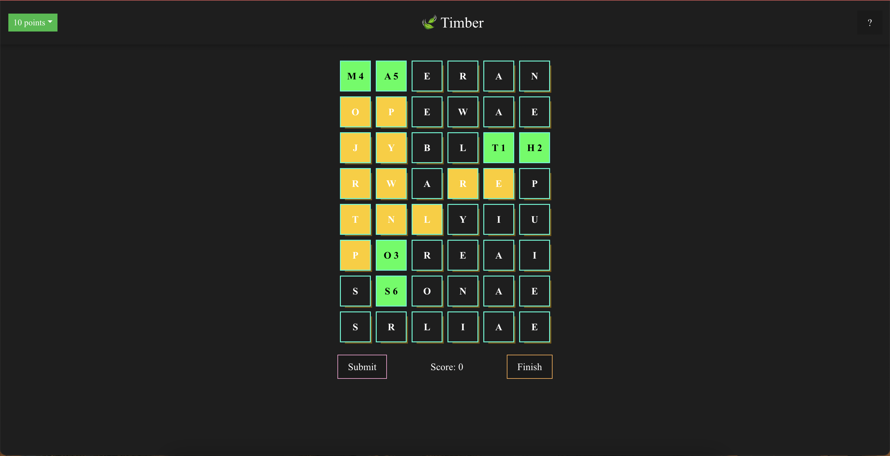
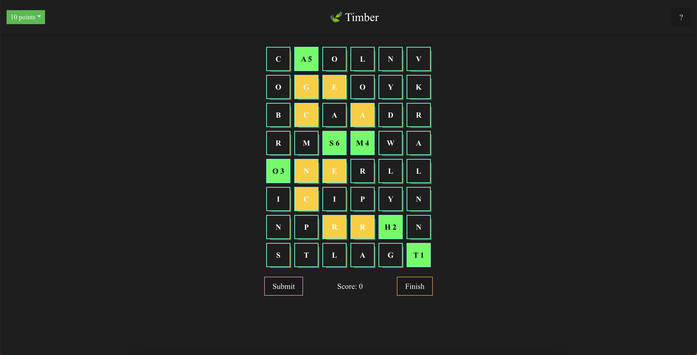
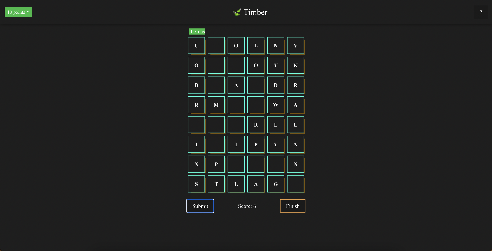
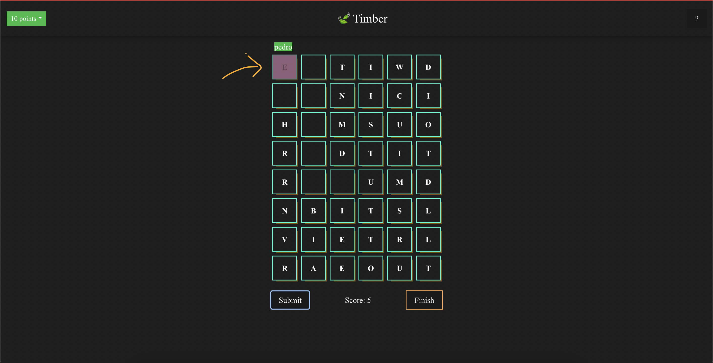

Hola! 
Let me introduce you to Timber, a word finding game I wrote in my days off.
I mainly wrote this project because I wanted to do a coding challenge utilizing the DSA I'm currently studying.

    
Attention

    <small>This post is not a tutorial. This post illustrates which DSA hide behind this game, in order to give you the means to build your own. With your rules, twists, tricks.... and of course learn in the process.</small>

 

<h4>Hello, Timber!</h4>

<small style="text-align:center;width:100%; display:inline-block;">Click on the image to go to the game. <a href="https://github.com/thomscoder/timber" target="_blank">(Source Code)</a></small>

<h4 style="padding: 20px; font-weight: normal;">Timber is a word finding game</h4>

As simple as that.

<h4>Rules</h4>

The rules of this game are pretty simple:

1. Click the letters to compose a word to submit.
2. Once you've submitted a word, Timber will delete all the letters selected.
3. The length of each word that is successfully found in the dictionary will be added to the score

4. (On easy mode the score is decreased if the word is not found).

5. Score at least the points requested by the game difficulty (top-left corner)

That's it...

...those are the rules.

<h6>Well...</h6>

To spice things up, Timber adds a layer of difficulty.

Timber allows the clicked letters to not necessarily be adjacent to each other. In that case, it will calculate a path to connect the letters. 
Once submitted, though, not only it will remove the clicked letters, but also every letter that belongs to the path.

 

---

<h4>Under the hood</h4>

Alright, those were the rules. Here's how they're implemented.

- On load, Timber, with the help of <a href="https://fakerjs.dev/" target="_blank">Fakerjs</a>, generates ~1 million random words.

<h4 style="padding: 20px; font-weight: normal;">Faker is a popular library used to generate massive amounts of fake (but realistic) data for testing and development.</h4>

- To fasten the word lookup on submit, Timber creates a <a href="https://en.wikipedia.org/wiki/Trie/" target="_blank">Trie</a> data structure and inserts each word in the trie.

<h4 style="padding: 20px; font-weight: normal;">A trie is a tree data structure used for locating specific keys from within a set.</h4>

- Timber calculates <strong>the shortest path</strong> by implementing the <a href="https://en.wikipedia.org/wiki/A*_search_algorithm" target="_blank">A*</a> a pathfinding algorithm.

<h4 style="padding: 20px; font-weight: normal;">A* aims to find a path to the given goal node having the smallest cost</h4>

> 💡 - <a href="https://en.wikipedia.org/wiki/Pathfinding" target="_blank">what is a pathfinding algorithm?</a>

- Timber detects one cell islands. (if the grid does not contains anymore islands of size bigger than one, the game ends). A good ole <a href="https://en.wikipedia.org/wiki/Depth-first_search" target="_blank">Depth First Search</a> implementation...

<h4 style="padding: 20px; font-weight: normal;">Depth First Search starts at the root node and explores as far as possible along each branch before backtracking.<small> - <a href="https://www.geeksforgeeks.org/depth-first-search-or-dfs-for-a-graph/" target="_blank">geeksforgeeks.org</a></small></h4>

 

> 💡 - if the letters of an island cannot form at least one word contained in the dictionary, remove the island.

<h5>Conclusion</h5>
As you can see it is not as simple as it may look visually, there's some work going on under the hood. 
I will continue to develop this project as I will get new ideas, learn new algorithms and new data structures.

The source code of Timber can be found <a href="https://github.com/thomscoder/timber" target="_blank">here</a>.
I hope I have sparked your curiosity a bit. 
If you want to contribute or give some feedback, you're always welcomed... Otherwise, have fun and keep on learning!

<h4>References</h4>
<a href="https://timberland.vercel.app" target="_blank">Timber game</a> 
<a href="https://github.com/thomscoder/timber" target="_blank">Contribute to Timber</a>